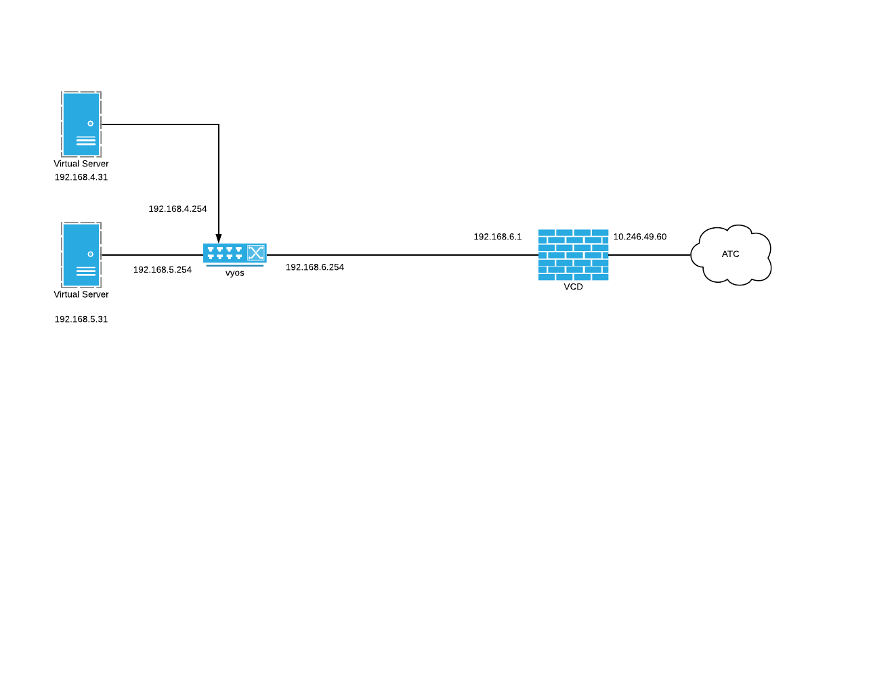

# README

The as-built directory contains support documentation for a platform lab. 

> This file is a sample markdown file for lab as-built documentation

> Edit as required to document the lab

> Remove the instructional callouts like these

## Table of Contents

  - [Lab Purpose](#lab-purpose)
  - [Intended Audience](#intended-audience)
  - [Lab Diagram](#lab-diagram)
    - [Lucid Chart Diagram](#lucid-chart-diagram)
      - [Imbeded LucidChart Image](#imbeded-lucidchart-image)
    - [Uploaded Image](#uploaded-image)
      - [Uploaded Image](#uploaded-image-1)
  - [Hardware Supporting the Lab](#hardware-supporting-the-lab)
  - [Cable Map](#cable-map)
  - [Internal Login Information](#internal-login-information)
  - [Console Information](#console-information)
  - [License Information](#license-information)
  - [Troubleshooting Information](#troubleshooting-information)
    - [Steps to Validate proper validation of the lab](#steps-to-validate-proper-validation-of-the-lab)
    - [FAQs regarding lab operation](#faqs-regarding-lab-operation)
    - [Common Problems](#common-problems)

<div id='lab-purpose'/>

## Lab Purpose

> In one or two paragraphs state the purpose of the lab

The intended goal of this lab is to go over the fundamentals of Tetration. 

The following will be covered in this lab.

* Profiling of Applications
* Automated Policy Creation
* Policy Analysis and Monitoring
* Automated Policy Enforcement
* Package Inventory and Vulnerabilities
* Long Lived Processes and Process Snapshot
* Path Analysis with the Neighborhood App

<div id='intended-audience'/>

## Intended Audience

> Who is the intended audience for the lab ?

This lab shows a first time Tetration adminstrator how to create policy and manage the system.

<div id='lab-diagrams'/>

## Lab Diagram

> Imbed a lab diagram from Lucidchart or from an uploaded image.

### Lucid Chart Diagram

For Lucid chart, publish the diagram as a png file. 

Insert a link to the lab diagram as shown below.
 
```
Imbed the image link as follows


```

#### Imbeded LucidChart Image


### Uploaded Image

Upload the image to the git respository

Imbed the image as show below:

```


```

#### Uploaded Image 


## Hardware Supporting the Lab

> Place a link to the lab bundle in AMS that lists the hardware that supports the lab

ATC Tetration 

<https://ams.apps.wwtatc.com/bundles/24>

<div id='cable-map'/>

## Cable Map

> Upload a cable map in excel format or imbed an image as show in the lab diagram section (if applicable..)

<div id='internal-login-information'/>

## Internal Login Information

> Specify the login credentials for internal use

| Device Name | Device Address | Protocol | Userid | Password |
| ---| --- | --- | --- | --- |
| Jump Box | 10.255.68.89 | RDP | admin | WWTwwt1! |

<div id='console-information'/>

## Console Information

> If used,  specify the console information

| Device Name | Console Server Address | Console Server Port | Console Server Credentials |
| ----------| ----------------- | --------- | -------- |
| Nexus01 | console01.wwt.atc.local | 7020 | admin / WWTwwt1! |

<div id='license-information'/>

## License Information

> Document any pertinent licensing information and expiration dates

| License Name | Expiration Date | License Source |
| ----------| ----------------- | --------- |
| Nexus Advanced | July 2021 | Cisco WWT Account Team |

<div id='troubleshooting-information'/>

## Troubleshooting Information

### Steps to Validate proper validation of the lab

> List the high level steps needed to verify the functioning of the lab

1. Step 1

2. Step 2

### FAQs regarding lab operation

> List commonly asked questions and answers about the lab

1. Question 1

2. Question 2

### Common Problems

> List any common issues with the lab and their resolution

1. Issue 1

2. Issue 2
